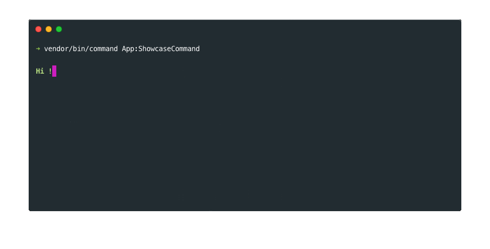

#Intro

## What is this library ?

The "sitphp/commands" library can help you to create commands super easily for your application or your library. You can also use it to build your own customized command tool.



## Requirements

This library requires at least PHP 7. It should be installed from composer which will make sure your configuration matches requirements.
 > {.note .info} Note : You can get composer here : [https://getcomposer.org](https://getcomposer.org).

        
## Install

Once you have composer installed, add the `"sitphp/commands": "1.0.*"` line in the `"require"` section of your composer.json file :
    
```json
{
    "require": {
        "sitphp/commands": "1.0.*"
    }
}
```

Then just run the following composer command to install the library :

```bash
composer update
```
