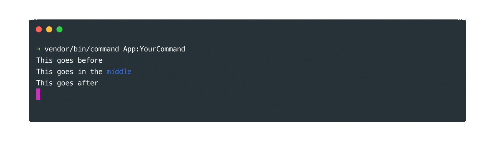
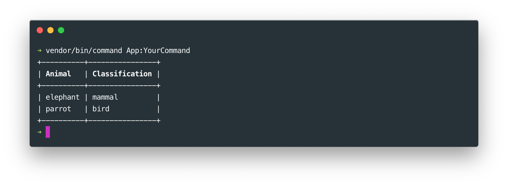

# Quick start

## Create the command class

To create a new command, simply create a new class extending the `\SitPHP\Commands\Command` class in the "Commands" folder of library or application. It should implement the `handle` method. Let's create, for example, a "YourCommand" class :

    ```php
    namespace App\Commands;
    
    class YourCommand extends \SitPHP\Commands\Command {
    
        function handle(){
            $this->write('hello');
        }
    
    }
    ```

## Run your command 

To run your command, you can use the `command` application located in the `vendor/bin` folder. To run a "YourCommand" command, you have to type this command in your terminal : 
    
    ```bash
    vendor/bin/command App:YourCommand
    ```
    
## Writing text messages

To write a message in your terminal, use the `write` or the `writeLn` methods. The `writeLn` method will write the message on a new line whereas the `write` method will write the message on the same line.
 
To display and line break, you can use the `lineBreak` method. This method can receive an integer argument to specify how many line breaks you wish to display.
    
    ```php
    namespace App\Commands;
    
    class YourCommand extends \SitPHP\Commands\Command {
    
        function handle(){
            $this->write('Hello,');
            
            // Single line break
            $this->lineBreak();
    
            $this->write('I am ');
            $this->write('Alex');
            
            // Double line break
            $this->lineBreak(2);
    
            $this->write('I code with PHP');
        }
  
    }
    ```
    


## Arguments and options

In order to retrieve options and arguments passed to your command, you must first register them in the `prepare` method of your command class. Here we will create a command that takes a "name" argument and a "color" option.

  
    
    ```php
    // In your command class ...
    
    function prepare()
    {
       // Register first argument (index 0) "name" 
       $this->setArgumentInfos('name', 0);
    
       // Register "color" option
       $this->setOptionInfos('color');
    }
    
    function handle()
    {
       // Retrieve name argument value
       $name = $this->getArgument('name');
       if ($name === null) {
           throw new \Exception('The "name" argument is required');
       }
       $message = 'My name is ' . $name;
       
       // Retrieve color option value
       $color = $this->getOption('color');
       if ($color !== null) {
           $message .= ' and I like the ' . $color . ' color';
       }
    
       $this->writeLn($message);
    }
    ```

To send the arguments to your command, just type their value in your terminal. Options are preceded with two hyphens (ex : `--color`). Options can take values like so `--color=red`. If no value is specified, the option value will be `true`.

You could run our previous command typing something like this in the terminal :

    ```bash
    vendor/bin/command App:YourCommand Alex --color=red
    ```
    
This would write : "My name is Alex and I like the red color".

## Styling

Anything written in the terminal can be easily styled just like in CSS using the `<cs>` tag.

- You can change the color of your text with the `color` attribute
- You can change the background color of your text with the `background-color` attribute
- You can make your text bold with the `bold` parameter of the `style` attribute
- You can highlight your text with `highlight` parameter of the `style` attribute
- You can underline your text with `underline` parameter of the `style` attribute
- You make your text blink with `blink` parameter of the `style` attribute (some terminals do not support blink)

Here are a few styling examples :
    
    ```php
    // In the "handle" method of your command class ...
    $this->writeLn('This will display in <cs color="blue">blue</cs>');
    $this->writeLn('This will display <cs style="bold;highlight">highlighted and bold</cs>');
    ```


## Tools

This package comes with some useful tools. It's also easy to build your own if you are using your own command application.

### Bloc tool

The bloc tool can display content in a box. A bloc is created with the `bloc` method and displayed with the `display` method. The width of the bloc will automatically adjust to the width of the content.
    
    ```php
    // In the "handle" method of your command class ...
    $this->bloc('I am a simple bloc ...')
        ->display();
    ```   

### Progress bar tool

To create a progress bar, use the `progress` method with one argument to specify the number of steps of your progress bar. Then display it using the `display` method. You can then move your line forward with the `progress` method. 
You might want to "stick" your progress bar with the `placeHere` method so that it does'nt show on a new line on each update.
    
    ```php
    // In the "handle" method of your command class ...
    
    // Create a 5 steps progress bar
    $progress_bar = $this->progressBar(5)
        ->placeHere()
        ->display();

    for($i = 1; $i <= 5; $i++){
        sleep(1);
        $progress_bar->progress();
    }
    ```


### The question tool

The question tool allows to ask for user input. Use the `question` method to create a new question. It can take to arguments : the question prompt and an array of autocomplete values.

    ```php
    // In the "handle" method of your command class ...
    function handle(){
        $genres = ['pop', 'rock', 'hip hop', 'classical'];
        $genre = $this->question('Which music genre do you like ?', $genres)
            ->ask();
        
        $this->lineBreak();
        $this->writeLn('Your favorite music genre is : '.$genre);
    }
    ```
    


### The choice tool

The choice tool allows you to ask the user to choose within a predefined set of choices. Use the `choice` method to create a new choice and ask for the user choice using the `ask` method. If the choice is optional, you might also want to enable the quit option with the `enableQuit` method. The choice question will be displayed until the user has given a correct choice or has quit when possible.
When the user chooses to quit, the choice method will return `null`.

The `choice` method can take up to three arguments to define available choices, the question prompt, and the title. 
    
    ```php
    // In the "handle" method of your command class ...
    function handle(){
        $choices = ['red', 'blue', 'green'];
        $color_index = $this->choice($choices, 'Which color do you like best ?', 'Colors')
            ->enableQuit()
            ->ask();
            
        if($color_index !== null){   
            $this->lineBreak(); 
            $this->writeLn('You like the '.$choices[$color_index].' color the best');
        }
    }
    ```

 

### Section tool

The section is used update content at a predefined position on the screen. You can create a section with the `section` method and place it where you decide with the `placeHere` method. Every content written in the section will shown at the placed position. Here is an example to illustrate this :
    
    ```php
    // In the "handle" method of your command class ...
    $this->writeLn('This goes before');
    $section = $this->section()->placeHere();
    $this->writeLn('This goes after');

    $section->writeLn('This goes in the <cs color="blue">middle</cs>');
    sleep(1);
    $section->overwriteLn('This goes in the <cs color="red">middle</cs>');
    ```



### Table tool

You can use the table tool display content in rows and columns. Use the `table` method to create a table. Then define every table row in an array. You can also insert line with the `line` method.

    ```php
    // In the "handle" method of your command class ...
    $this->table([
        ['<cs style="bold">Animal</cs>', '<cs style="bold">Classification</cs>'],
        'line',
        ['elephant', 'mammal'],
        ['parrot', 'bird']
    ])->display();
    ```

