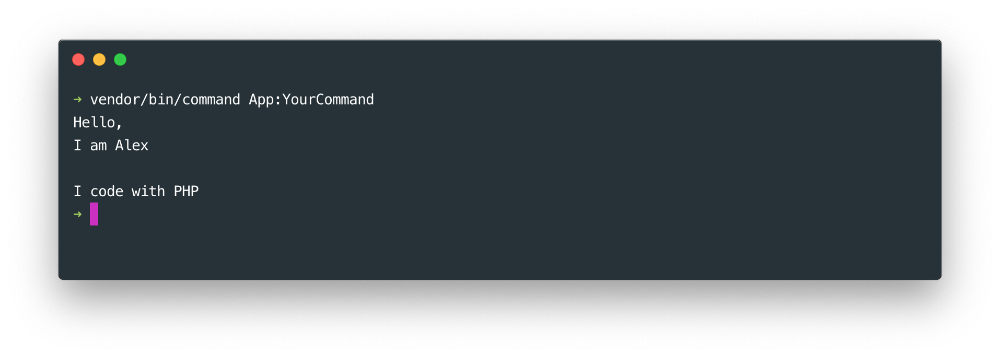
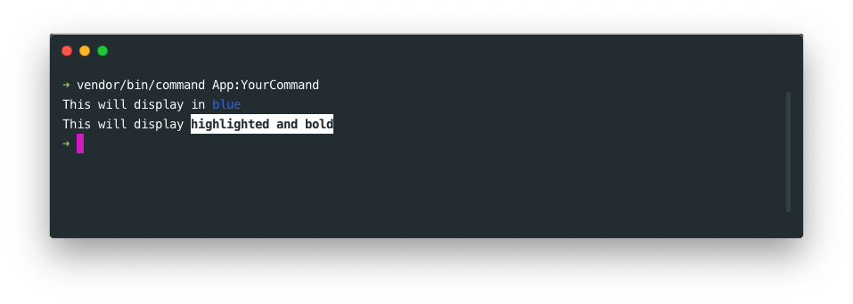

# Making commands

## Basics 

### Create the command class

To create a new command, simply create a new class extending the `\SitPHP\Commands\Command` class in the "Commands" folder of library or application. It should implement the `handle` method. Let's create, for example, a "YourCommand" class :

```php
namespace App\Commands;

class YourCommand extends \SitPHP\Commands\Command {

    function handle(){
        $this->write('hello');
    }

}
```

### Run your command 

To run your command, you can use the `command` application located in the `vendor/bin` folder. To run a "YourCommand" command, you have to type this command in your terminal : 

```bash
vendor/bin/command App:YourCommand
```


## Writing text messages

### Basics

To write a message in your terminal, use the `write` or the `writeLn` methods. The `writeLn` method will write the message on a new line whereas the `write` method will write the message on the same line.
 
To display and line break, you can use the `lineBreak` method. This method can receive an integer argument to specify how many line breaks you wish to display.
    
```php
namespace App\Commands;

class YourCommand extends \SitPHP\Commands\Command {

    function handle(){
        $this->write('Hello,');
        
        // Single line break
        $this->lineBreak();

        $this->write('I am ');
        $this->write('Alex');
        
        // Double line break
        $this->lineBreak(2);

        $this->write('I code with PHP');
    }

}
```
    

    

### Verbosity

You can define the verbosity of your messages so that they appear only when they match the command verbosity. All verbosity levels are available in your command class :

```php
namespace App\Commands;
    
class YourCommand extends \SitPHP\Commands\Command {

    function handle(){
        $this->writeLn('This message is quiet', self::VERBOSITY_QUIET);
        $this->writeLn('This message is standard');
        $this->writeLn('This message is verbose', self::VERBOSITY_VERBOSE);
        $this->writeLn('This message is debug', self::VERBOSITY_DEBUG);
    }

}
```
    
If you run the following command, no message will be displayed :
    
```bash
vendor/bin/command App:YourCommand --silent
```
    
If you run the following command, only the quiet message will be displayed :

```bash
vendor/bin/command App:YourCommand --quiet
```
    
If you run the following command, only the quiet and standard messages will be displayed :

```bash
vendor/bin/command App:YourCommand
```
    
If you run the following command, the quiet, standard and verbose messages will be displayed :

```bash
vendor/bin/command App:YourCommand --verbose
```
    
If you run the following command, all messages will be displayed :

```bash
vendor/bin/command App:YourCommand --debug
```
    
    
### Text width

You can define the width of your messages in the 3rd argument of the `write` and `writeLn` methods. If the text is longer than the defined width it will continue to be written onto the next line.

```php

// In your command class ...
function handle(){
    $this->write('a very long message ...', null, 10);
}
```
   


## Arguments and options

### Basics
In order to retrieve options and arguments passed to your command, you must first register them in the `prepare` method of your command class. Here we will create a command that takes a "name" argument and a "color" option.

  
    
```php
// In your command class ...

function prepare()
{
   // Register first argument (index 0) "name" 
   $this->setArgumentInfos('name', 0);

   // Register "color" option
   $this->setOptionInfos('color');
}

function handle()
{
   // Retrieve name argument value
   $name = $this->getArgument('name');
   if ($name === null) {
       throw new \Exception('The "name" argument is required');
   }
   $message = 'My name is ' . $name;
   
   // Retrieve color option value
   $color = $this->getOption('color');
   if ($color !== null) {
       $message .= ' and I like the ' . $color . ' color';
   }

   $this->writeLn($message);
}
```

To send the arguments to your command, just type their value in your terminal. Options are preceded with two hyphens (ex : `--color`). Options can take values like so `--color=red`. If no value is specified, the option value will be `true`.

You could run our previous command typing something like this in the terminal :

```bash
vendor/bin/command App:YourCommand Alex --color=red
```
    
This would write : "My name is Alex and I like the red color".


### Option flags

For easier typing options can be replaced with "flags" which are written with one preceding hyphen like this for example : `-c`.
You can define available flag replacement for your options in the 2nd argument of the `setOptionInfos` method.
    
```php
//...
function prepare()
{
    $this->setOptionInfos('color', 'c');
}

function handle()
{
    $color = $this->getOption('color');
    if ($color !== null) {
        $this->writeLn('You have chosen the ' . $color . ' color');
    } else {
        $this->writeLn('You have not chosen any color');
    }
}
```
    
    
Then you could run this command :

```bash
vendor/bin/command App:YourCommand --color=red
```
    
Or simply :
    
```bash
vendor/bin/command App:YourCommand -c=red
```
    
It is also possible to define multiple flags and find out which one has been typed with the `getFlag` method. Here is an example of what you could do :

```php
function prepare(){
    $this->setOptionInfos('size', ['s', 'm', 'l']);
}

function handle(){
    $size = $this->getOption('size');
    if($size !== null){
        if($this->getFlag('s')){
            $this->writeLn('You wear S');
        } else if($this->getFlag('m')){
            $this->writeLn('You wear M');
        } else if($this->getFlag('l')){
            $this->writeLn('You wear L');
        } else {
            $this->writeLn('You wear '.$size);
        }
    } else {
        $this->writeLn('You have not chosen any size');
    }
}
```

### Defining help

Running a command with with the predefined "--help" option (or the "-h" flag) will display a help message on how to use the command. For example, you can get help about how to use the predefined "list" command like this :

```bash
vendor/bin/command list --help
```
    
You can define the help message to display for your command and its parameters in the `prepare` method of your command class :
    
```php
//...
function prepare(){
    $this->setDescription('The description of your command');
    $this->setArgumentInfos('name', 0, 'Your name');
    $this->setOptionInfos('color', 'c', 'Your favorite color');
}
   
function handle(){
    // ...
}
```

Running the following command will show a help message for your command
    
```bash
vendor/bin/command App:YourCommand --help
```


### Predefined options and commands

If you have run your command help may have noticed some help messages about some options you haven't defined yourself. These are predefined options available for all commands :

--help (-h)          Shows a help message about the command              
--silent             Silent mode : hide all messages      
--quiet              Quiet mode : show only quiet messages
--verbose            Verbose mode : show verbose messages 
--debug              Debug mode : show debug messages     
--format             Force output to format               
--no-format          Force output not to format           
--no-interaction     Do not show interactive messages 

## Styling text

### Basics

Anything written in the terminal can be easily styled just like in CSS using the `<cs>` tag.

- You can change the color of your text with the `color` attribute. Available colors are :  'black', 'red','green','yellow','blue','purple','cyan','light_grey','dark_grey','light_red','light_green','light_yellow','light_blue','pink','light_cyan' and 'white'.
- You can change the background color of your text with the `background-color` attribute. Available colors are : 'black','red','green','yellow','blue','purple','cyan','light_grey',dark_grey','light_red','light_green','light_yellow','light_blue','pink','light_cyan' and 'white'.
- You can make your text bold with the `bold` parameter of the `style` attribute
- You can highlight your text with `highlight` parameter of the `style` attribute
- You can underline your text with `underline` parameter of the `style` attribute
- You make your text blink with `blink` parameter of the `style` attribute (some terminals do not support blink)

Here are a few styling examples :
    
```php
// In the "handle" method of your command class ...
$this->writeLn('This will display in <cs color="blue">blue</cs>');
$this->writeLn('This will display <cs style="bold;highlight">highlighted and bold</cs>');
```


    
### Style tags

Style tags allow you to style your messages with a predefined style. There are already a few style tags available :

```php
// In the "handle" method of your command class ...
$this->writeLn('This will appear in <error>blue</error>');
$this->writeLn('This will appear in <warning>yellow</warning>');
$this->writeLn('This will appear <info>blue</info>');
$this->writeLn('This will appear <success>green</success>');
```
    
    
    
### Displaying style tags

If you are using style tags in your messages and you don't want them to be interpreted as style tags, you can escape those tags with "\" character so that they will be displayed and not interpreted as style tags. You can also set the 4rth argument of the `write` and `writeLn` methods to `true` so that your whole message will be displayed as text without any tag interpretation.

```php
// In the "handle" method of your command class ...

// Don't format escaped tags
$this->writeLn('<cs color="red">my message with \<error>inner\<\error> tags</cs>');
    
// Don't format this text and display as it is
$this->writeLn('<cs color="red">my message with tags</cs>', null, null, false);
```    
    
    
### Creating your own style tag   

If you are using your own command application, you can create your own style tags with the console formatter. Let's build a "mytag" style tag for example :
    
```php
// ...
$command_manager->getFormatter()
    ->buildTagStyle('mytag')
    ->setBackgroundColor('red')
    ->setColor('white')
    ->bold(true)
    ->underline(true);
```
        
Then you can the use your newly created style in your commands.
     
 ```php
// In the "handle" method of your command class ...      
$this->writeLn('This will appear in <mytag>my way</mytag>');
```
    
## Prevent multiple command execution

Its easy to prevent multiple executions of the same command. You just need to retrieve the execution count from the `getExecutionCount` method and stop the execution when the command has reached the number of executions you wish.

 ```php
// In the "handle" method of your command class ...         

// This command cannot be executed more than one time
if($this->getExecutionCount() > 1){
   return 0;
}
```


## Programmatically executing commands

You can call a command Programmatically from within another command with the `call` method.
    
```php
// In the "handle" method of your command class ...         
$this->call('MyApp:OtherCommand', ['param1', '--option1=value']);
```


## Hiding a command from the list command

The "list" command shows information about all registered commands. If you don't want your command to appear in the list, you can hide it with the `hide` method.

```php
// In the "prepare" method of your command class ...         
$this->hide();
```