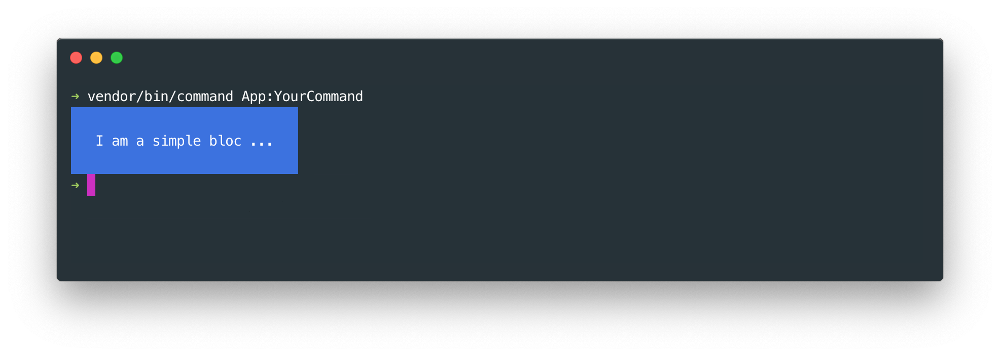
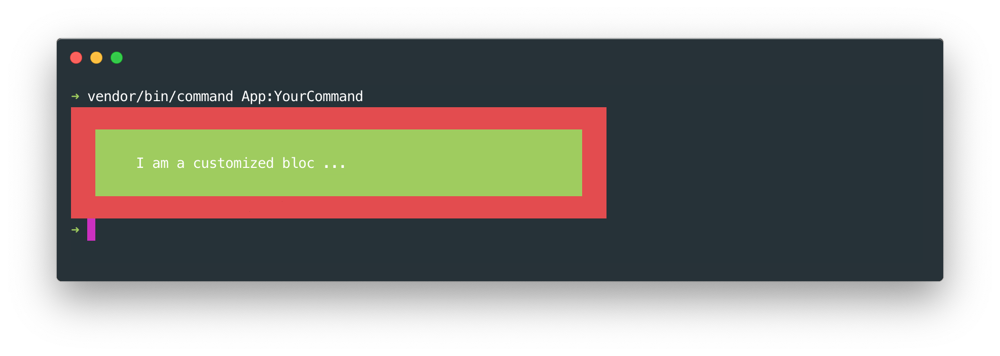
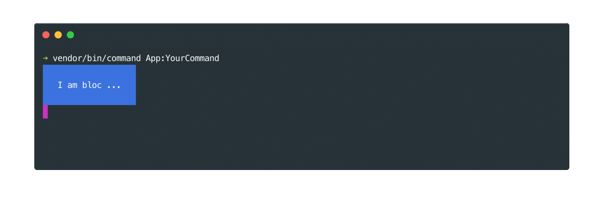

# Bloc tool

## Basics

### Creating a simple bloc

The bloc tool can display content in a box. A bloc is created with the `bloc` method and displayed with the `display` method. The width of the bloc will automatically adjust to the width of the content.
    
    ```php
    // In the "handle" method of your command class ...
    $this->bloc('I am a simple bloc ...')
        ->display();
    ```
    
    

### Setting bloc content
    
You can also add, prepend, set or clear bloc content by  bloc content using the `addContent`, `prependContent`, `setContent` or `clear` methods.

    ```php
    // In the "handle" method of your command class ...
    $bloc = $this->bloc('content ...');
    $bloc->clear();
    $bloc->setContent('middle');
    $bloc->addContent(' after');
    $bloc->prependContent('before ');
    $bloc->display();
    ```

The content of the bloc will be "before middle after".

## Styling

### Customizing a bloc

You can modify the display of a bloc as you wish. Here is an example of what you could do :
          
          
    ```php
    // In the "handle" method of your command class ...
    $this->bloc('I am a customized bloc ...')
        // Set width to 50 characters
        ->setWidth(50)
        // Set top and bottom padding width to 1 character, 
        // left and right padding to 5 characters
        ->setPadding(1, 5) 
        // Set top and bottom border width to 1 character, 
        // left and right border to 3 characters,
        // border color to red
        ->setBorder(1, 3, 'red') 
        ->setBackgroundColor('green')
        ->display();
    ```
    

      
### Creating a style      
      
If you are using your own command tool, you can also build a custom style using the bloc manager :

    ```php
    // In your command application file ...
    $command_manager->getblocManager()
        ->buildStyle('your-style')
        ->setBackgroundColor('yellow')
    ```
        
And then simply apply your style to your bloc like this :

    ```php
    // In the "handle" method of your command class ...
    $color_index = $this->bloc('content ...')
        ->setStyle('your-style')
        ->display();
    ```    
    
## Verbosity

And a bloc can easily be displayed or not depending on the verbosity. Also content can easily be added, prepended, cleared or not depending on the verbosity. 

In the following example, the bloc will only be displayed with the "--verbose", or the "--debug" options. 

    ```php
    // In the "handle" method of your command class ...
    $bloc = $this->bloc();
    $bloc->addContent('content ...');
    $bloc->display(self::VERBOSITY_VERBOSE);
    ```
    
In the following example, the message "more details ..." will only be displayed with the "--debug" option.
    
    ```php
    // In the "handle" method of your command class ...
    $bloc = $this->bloc();
    $bloc->addContent('content ...');
    $bloc->addContent('more details ...', self::VERBOSITY_DEBUG);
    $bloc->display();    
    ```
    
    
## Sticky bloc

You can "stick" your bloc to the same position with the `placeHere` method. You can then dynamically update your bloc. For example

    ```php
    // In the "handle" method of your command class ...
    $bloc = $this->bloc('I am bloc ...')->placeHere()->display();
    
    sleep(1);
    $bloc->setContent('I am a sticky bloc ...')->display();
    sleep(1);
    $bloc->setBackgroundColor('green')->display();
    ```
    
