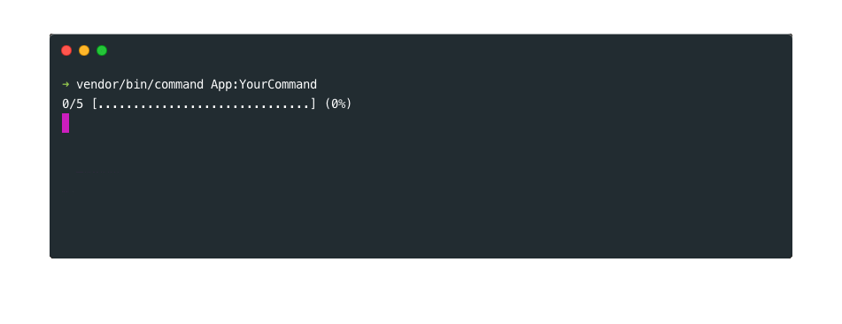
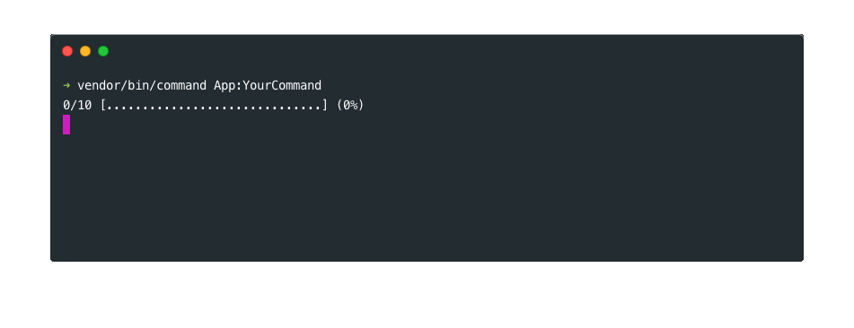
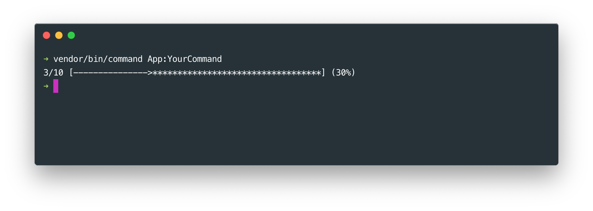
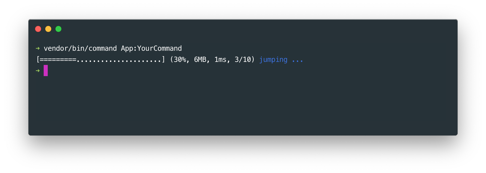

# Progress bar tool

## Basics

### Creating a simple progress bar

To create a progress bar, use the `progress` method with one argument to specify the number of steps of your progress bar. Then display it using the `display` method. You can then move your line forward with the `progress` method. 
You might want to "stick" your progress bar with the `placeHere` method so that it does'nt show on a new line on each update.
    
    ```php
    // In the "handle" method of your command class ...
    
    // Create a 5 steps progress bar
    $progress_bar = $this->progressBar(5)
        ->placeHere()
        ->display();

    for($i = 1; $i <= 5; $i++){
        sleep(1);
        $progress_bar->progress();
    }
    ```



### Jumping to step
 
The progress line can also regress, jump and dive :). Cool isn't it ? The `regress` method will move the progress line one step back. The `jump` method will move the progress line "n" steps forward and the `dive` method will move it "n" steps backwards. Example ladies and gentleman :

    ```php
    // In the "handle" method of your command class ...
    $progress_bar = $this->progressBar(10)
        ->placeHere()
        ->display();
    
    sleep(1);
    $progress_bar->jump(5);
    sleep(1);
    $progress_bar->regress();
    sleep(1);
    $progress_bar->dive(3);
    ```

 

You can also move the progress line to a specific step with the `goToStep` method

    ```php
    // In the "handle" method of your command class ...
    $progress_bar = $this->progressBar(10)
        ->placeHere()
        ->display();
            
    $progress_bar->goToStep(3)
        
    ```
    
If you don't know how many steps your progress bar should have you can always update the steps number as you go with the `setSteps` method. Whenever your process has ended, you can move the progress line to the end of the progress bar with the `finish` method.

    ```php
    // In the "handle" method of your command class ...
    $progress_bar = $this->progressBar(10)
        ->placeHere()
        ->display();
        
    for($i = 1; $i <= 5; $i++){    
        $progress_bar->progress();
    }
    sleep(1);
    $progress_bar->setSteps(6);
    sleep(1);
    $progress_bar->finish();  
    ```    

### Showing messages

Note that the `display`, `progress`, `regress`, `jump`, `dive`, `goToStep` and `finish` methods can take a $message argument to be displayed near the progress bar.   
        
    ```php
    // In the "handle" method of your command class ...
    $progress_bar = $this->progressBar(10)
        ->placeHere()
        ->display('displaying ...');
        
    sleep(1);
    $progress_bar->jump(3, 'jumping ...');
    sleep(1);
    $progress_bar->regress('regressing ...');
    ```
   

    
### Finishing

Once the progress line has reached the end, it auto finishes which means you cannot change its progress status anymore. Unless you disable the auto finish with the `disableAutoFinish` method ... You will then have to end the progress yourself with the `finish` method.

    ```php
    // In the "handle" method of your command class ...
    $progress_bar = $this->progressBar(10)
      ->placeHere()
      ->disableAutoFinish()
      ->display('displaying ...');
    
    sleep(1);
    $progress_bar->jump(10, 'jumping ...');
    sleep(1);
    $progress_bar->regress('regressing ...');
    sleep(1);
    $progress_bar->finish('finished ...');
    $progress_bar->regress('not working ...');
    ```
    
    
## Styling

### Customizing a progress bar

You can change width and the characters of the progress line to create your own custom progress bar.

    ```php
    // In the "handle" method of your command class ...
    $progress_bar = $this->progressBar(10)
        ->placeHere()
        ->setWidth(50)
        ->setProgressChar('-')
        ->setSpaceChar('*')
        ->setIndicatorChar('>')
        ->display();

    $progress_bar->jump(3);
    ```



You can also change the whole display of the progress bar and decide which information you want to show and how you want to show them with the `setFormat` method.

    ```php
    // In the "handle" method of your command class ...
    $progress_bar = $this->progressBar(10)
        ->placeHere()
        ->setFormat('[%bar%] (%percents%, %memory%, %elapsed%, %steps%) <cs color="blue">%message%</cs>')
        ->display();

    $progress_bar->jump(3, 'jumping ...');
    ```

    
    
### Creating a style    
    
If you are using your own command application, you can also build a progress bar style using the progress bar manager :

    ```php
    // In your command application file ...
    $command_manager->getProgressBarManager()
        ->buildStyle('your-style')
        ->setWidth(50)
        ->setFormat('%bar% (%percents%, %memory%, %elapsed%, %steps%) <cs color="blue">%message%</cs>')
    ```
        
And then simply apply your style to your choice like this :
    
    ```php
    // In the "handle" method of your command class ...
    $progress_bar = $this->progressBar(10)
        ->placeHere()
        ->setStyle('your-style')
        ->display();
    ```

## Verbosity

A progress bar can easily be displayed or not depending on the verbosity. In the following example, the progress bar will only be displayed with the "--verbose", or the "--debug" options. 
    
    ```php
    // In the "handle" method of your command class ...
    $progress_bar = $this->progressBar(10);
    $progress_bar->display(self::VERBOSITY_VERBOSE);
    ```


 