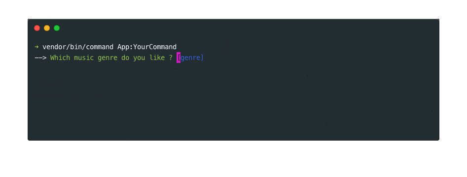

# Question tool

## Basics

### Creating a simple question

The question tool allows to ask for user input. Use the `question` method to create a new question. It can take to arguments : the question prompt and an array of autocomplete values.

    ```php
    // In the "handle" method of your command class ...
    function handle(){
        $genres = ['pop', 'rock', 'hip hop', 'classical'];
        $genre = $this->question('Which music genre do you like ?', $genres)
            ->ask();
        
        $this->lineBreak();
        $this->writeLn('Your favorite music genre is : '.$genre);
    }
    ```
    


### Placeholder
    
It is possible to display a placeholder with the `setPlaceholder` method. It will only show when the user has not started typing his answer:

    ```php
    // In the "handle" method of your command class ...
    $genres = ['pop', 'rock', 'hip hop', 'classical'];
    $genre = $this->question('Which music genre do you like ?', $genres)
        ->setPlaceholder('[genre]')
        ->ask();
    ```
    
### Dynamic autocomplete
    
The autocomplete values can be dynamically updated as you type. The following code, for example will only display autocomplete for the first character typed : 

    ```php
    // In the "handle" method of your command class ...
    $genre = $this->question('Which music genre do you like ?', function($input){
        if(mb_strlen($input) === 1){
            return ['red', 'green', 'blue'];
        }
    })->ask();
    ```
    
## Styling

### Customizing a question

You can modify the question display as you wish. Here is a example of what you can do :

    ```php
    // In the "handle" method of your command class ...
    $genres = ['pop', 'rock', 'hip hop', 'classical'];
    $genre = $this->question('Which music genre do you like ?', $genres)
        ->setPlaceholder('[genre]')
        // Custom prompt display
        ->setPromptFormat('--> <cs color="green">%prompt%</cs> ')
        // Custom input display
        ->setInputFormat('<cs color="white">%input%</cs>')
        // Custom autocomplete display
        ->setAutoCompleteFormat('<cs background-color="light_grey" color="black">%autocomplete%</cs>')
        // Custom placeholder display
        ->setPlaceholderFormat('<cs color="blue">%placeholder%</cs>')
        // Ask the question
        ->ask();
    ```
 



### Creating a style
    
If you are using your own command application, you can also build a question style using the question manager :

    ```php
    // In your command application file ...
    $command_manager->getQuestionManager()
        ->buildStyle('your-style')
        ->setPromptFormat('> %prompt% ')
    ```
 
        
And then simply apply your style to your choice like this :

    ```php
    // In the "handle" method of your command class ...
    $genres = ['pop', 'rock', 'hip hop', 'classical'];
    $genre = $this->question('Which music genre do you like ?', $genres)
        ->setStyle('your-style')
        ->ask();
    ```
        


## Verbosity

A question can easily be displayed or not depending on the verbosity. In the following example, the question will only be displayed with the "--verbose", or the "--debug" options. 

    ```php
    // In the "handle" method of your command class ...
    $question = $this->question('Which music genre do you like ?')
    $question->ask(self::VERBOSITY_VERBOSE);
    ```
       
        
## Sticky question

You can "stick" your question to the same position with the `placeHere` method. This would be useful, for example, to validate an answer and re-ask the question while the answer value isn't the one you expect.
    
    ```php
    // In the "handle" method of your command class ...
    $genres = ['pop', 'rock', 'hip hop', 'classical'];
    $question = $this->question('Which music genre do you like ?', $genres)->placeHere();
    do{
        $genre = $question->ask();
        if(in_array($genre, $genres)){
            break;
        }
    } while(true);

    $this->lineBreak();
    $this->writeLn('You like '.$genre.' music');
    ```

    

If your question is placed, you can also display it first and ask the question later. This could be useful to display many questions before actually asking for the user answer. For example :
    
    ```php
    // In the "handle" method of your command class ...
    $question_1 = $this->question('Which music genre do you like ?')
        ->placeHere()
        ->display();
    
    $this->lineBreak();     
        
    $question_2 = $this->question('What is your favorite color ?')
        ->placeHere()
        ->display();
        
    $answer_1 = $question_1->ask();
    $answer_2 = $question_2->ask();
    ```