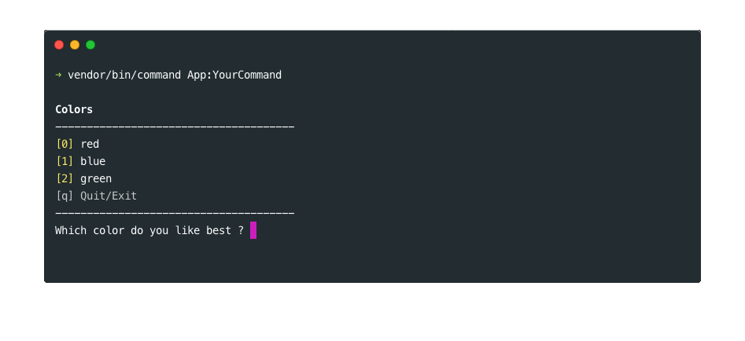
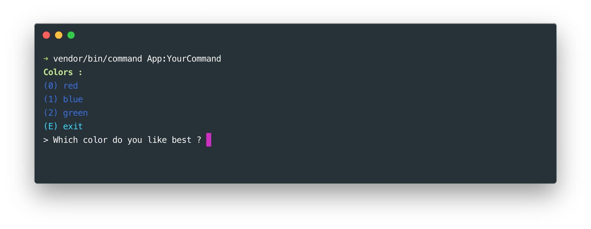
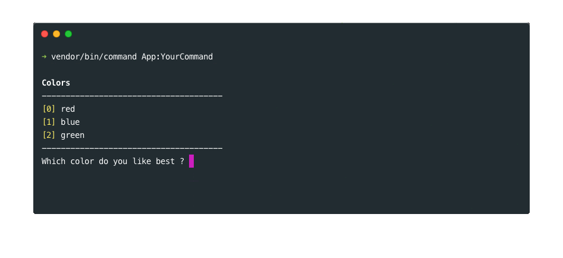

# The choice tool

## Basics

### Creating a simple choice question

The choice tool allows you to ask the user to choose within a predefined set of choices. Use the `choice` method to create a new choice and ask for the user choice using the `ask` method. You might also want to let user quit without answering with the `enableQuit` method. The choice question will be re-displayed until the user has given a correct choice or has quit if possible.
When the user chooses to quit, the choice method will return `null`.

The `choice` method can take up to three arguments : an array of choices, the question prompt, and the title. 
    
```php
// In the "handle" method of your command class ...
function handle(){
    $choices = ['red', 'blue', 'green'];
    $color_index = $this->choice($choices, 'Which color do you like best ?', 'Colors')
        ->enableQuit()
        ->ask();
        
    if($color_index !== null){   
        $this->lineBreak(); 
        $this->writeLn('You like the '.$choices[$color_index].' color the best');
    }
}
```

 

### Max attempts
 
It's also possible the define the maximum number of attempts allowed before the choice question is no more displayed and returns `false`.

```php
// In the "handle" method of your command class ...
$choices = ['red', 'blue', 'green'];
$color_index = $this->choice($choices, 'Which color do you like best ?', 'Colors')
    ->setMaxAttempts(3)
    ->ask();

if(!$color_index){
    $this->lineBreak();
    $this->writeLn('You have reached the maximum attempts');
}
```
 
## Styling

### Customizing a choice question

You can modify the choice question display as you wish. Here is an example of what you could do with all the styling methods available :

```php
// In the "handle" method of your command class ... 
$choices = ['red', 'blue', 'green'];
$color_index = $this->choice($choices, 'Which color do you like best ?', 'Colors')
   ->enableQuit()
   // Custom title display
   ->setTitleFormat('<cs color="green" style="bold; underline">%title% :</cs>')
   // Custom prompt display
   ->setPromptFormat('> %prompt% ')
   // Custom input display
   ->setInputFormat('<cs color="purple">%input%</cs>')
   // Custom autocomplete display
   ->setAutoCompleteFormat('<cs background-color="light_gray" color="black">%autocomplete%</cs>')
   // Custom choice display
   ->setChoiceFormat('<cs color="blue">(%key%)</cs>', '<cs color="blue">%value%</cs>')
   // Custom quit format
   ->setQuitFormat('<cs color="cyan">(%key%)</cs>', '<cs color="cyan">%value%</cs>')
   ->setQuitMessage('E', 'exit')
   // Custom error display
   ->setErrorFormat(' <cs color="red">-- %error% --</cs>')
   ->setErrorMessage('The choice "%input%" is not available')
   // Ask
   ->ask();
```
    
     
    
### Creating a style 
    
If you are using your own command application, you can also build a choice style using the choice manager :

```php
// In your command application file ...
$command_manager->getChoiceManager()
    ->buildStyle('your-style')
    ->setPromptFormat('> %prompt% ')
    // etc
```
        
And then simply apply your style to your choice like this :

```php
// In the "handle" method of your command class ...
$choices = ['red', 'blue', 'green'];
$color_index = $this->choice($choices, 'Which color do you like best ?', 'Colors')
    ->setStyle('your-style')
    ->ask();    
```
        
        
## Multiple choices

By default, it's only possible to choose one answer among available choices. If you wish to allow multiple choices, you can use the `enableMultiSelect` method. Users will then be able to select multiple answers by typing a set of comma separated choices.
        
```php
// In the "handle" method of your command class ...
$choices = ['red', 'blue', 'green'];
$color_indexes = $this->choice($choices, 'Which color do you like best ?', 'Colors')
    ->enableMultiSelect()
    ->ask();

$colors = [];
foreach($color_indexes as $color_index){
    $colors[] = $choices[$color_index];
}
$colors = implode(', ', $colors);

$this->lineBreak(2);
$this->writeLn('Your favorite colors are : '.$colors);
```
    
  

## Sticky choice

You can "stick" your choice question to the same position with the `placeHere` method. This could be useful when you don't want the question to be re-displayed when the user types an invalid choice.

```php
// In the "handle" method of your command class ...
$choices = ['red', 'blue', 'green'];
$color_index = $this->choice($choices, 'Which color do you like best ?', 'Colors')
    ->placeHere()
    ->ask();
```

      

If your choice question is placed, you can also display it first and ask the question later. This could be useful to display many choice questions before actually asking the user for an answer. For example :
    
```php
// In the "handle" method of your command class ...
$this->writeLn('Here is the list of questions for you :');
$colors = ['red', 'blue', 'green'];
$choice_1 = $this->choice($colors, 'Which color do you like best ?', 'Colors')
    ->placeHere()
    ->display();

$this->lineBreak(2);

$genres = ['pop', 'rock', 'classical'];
$choice_2 = $this->choice($genres, 'Which  music genre do you like best ?', 'Music genre')
    ->placeHere()
    ->display();

$answer_index_1 = $choice_1->ask();
$answer_index_2 = $choice_2->ask();
```

## Verbosity

A choice question can be displayed or not depending on the verbosity. In the following example, the choice question will only be displayed with the "--verbose", or the "--debug" options. 
    
```php
// In the "handle" method of your command class ...
$choices = ['red', 'blue', 'green'];
$choice = $this->choice($choices,  'Which color do you like best ?')
$choice->ask(self::VERBOSITY_VERBOSE);
```          