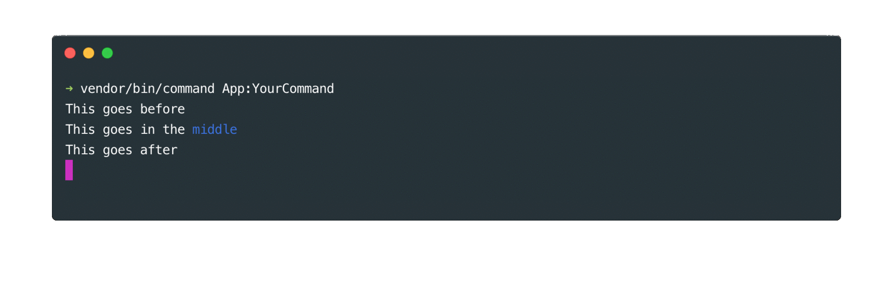
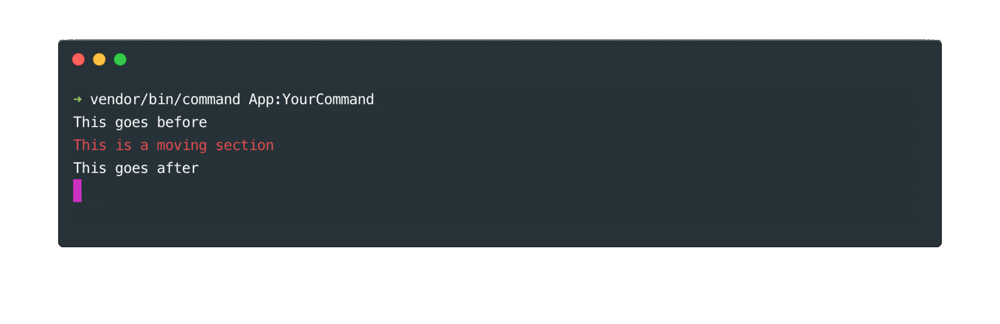

# Section tool

## Basics

### Creating a simple section

The section is used to update or move content at a predefined position on the screen. You can create a section with the `section` method and place it where you decide with the `placeHere` method. Every content in the section will written at the placed position. Here is an example to illustrate this :

```php
// In the "handle" method of your command class ...
$this->writeLn('This goes before');
$section = $this->section()->placeHere();
$this->writeLn('This goes after');

$section->writeLn('This goes in the <cs color="blue">middle</cs>');
sleep(1);
$section->overwriteLn('This goes in the <cs color="red">middle</cs>');
```



### Moving a section
   
Sections can also be easily moved around with the `placeHere` method. Try this for example :

```php
// In the "handle" method of your command class ...
$this->writeLn('This goes before');
$section = $this->section()
    ->placeHere()
    ->writeLn('This is a moving section');
$this->writeLn('This goes after');

sleep(1);
$section->placeHere();
```
    
    
    
> {.info} The section tool is used by other tools for their "sticky" display. For example you can use `$this->bloc()->placeHere()` to display a bloc content at the same place on the screen all the time. You might also the section tool to build your own command tool.

## Verbosity

A section can message be displayed or not depending on the verbosity.

```php
// In the "handle" method of your command class ...
$section = $this->section()->placeHere();
$section->writeLn('This message is quiet', self::VERBOSITY_QUIET);
$section->writeLn('This message is standard');
$section->writeLn('This message is verbose', self::VERBOSITY_VERBOSE);
$section->writeLn('This message is debug', self::VERBOSITY_DEBUG);
```
    