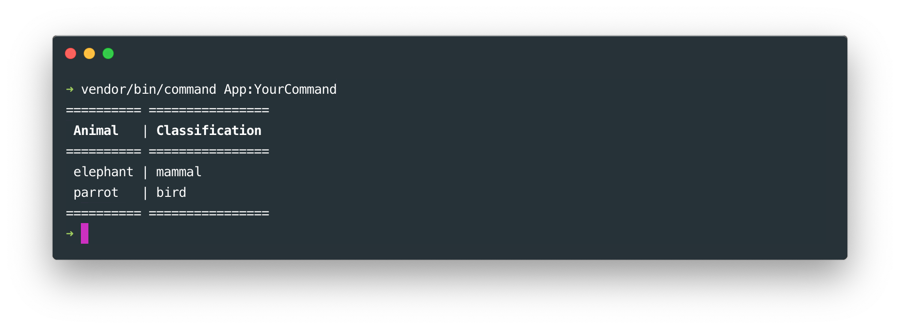

# The table tool

## Basics

### Creating a simple table

You can use the table tool display content in rows and columns. Use the `table` method to create a table. Then define every table row in an array. You can also insert line with the `line` method.

    ```php
    // In the "handle" method of your command class ...
    $this->table([
        ['<cs style="bold">Animal</cs>', '<cs style="bold">Classification</cs>'],
        'line',
        ['elephant', 'mammal'],
        ['parrot', 'bird']
    ])->display();
    ```

    
    
### Width & height    
    
You can control the column width and row height. Let's set the first column width to 30 characters and the second row height to 3 characters :

    ```php
    // In the "handle" method of your command class ...
    $this->table([
        ['elephant', 'mammal'],
        ['parrot', 'bird']
    ])
    ->setColumnWidth(1, 30)
    ->setRowHeight(2, 3)
    ->display();
    ```
 

You can also set the maximum column width and row height :

    ```php
    // In the "handle" method of your command class ...
    $this->table([
        ['elephant', 'mammal'],
        ['parrot', 'bird']
    ])
    ->setMaxColumnWidth(1, 30)
    ->setMaxRowHeigh(1, 2)
    ->display();
    ```

### Header & footer

Use the `setHeader` and `setFooter` methods to display header and footer messages :

    ```php
    // In the "handle" method of your command class ...
    $this->table([
        ['elephant', 'mammal'],
        ['parrot', 'bird']
    ])
    ->setHeader('header')
    ->setFooter('footer')
    ->display();
    ```
   
    
   

## Spanning cells

You might want a cell to span over multiple rows and columns. This is possible by defining cell parameters :
    
    ```php
    // In the "handle" method of your command class ...
    $this->table([
        ['elephant', 'mammal'],
        ['parrot', 'bird'],
        ['{colspan = 2}...']
    ])->display();
    ```
    
 

    ```php
    // In the "handle" method of your command class ...
    $this->table([
        ['{colspan = 2; rowspan = 2}...', 'item1'],
        [null, null, 'item2'],
        ['item3', 'item4', 'item5']
    ])->display();
    ```
    
   
   

## Styling

### Customizing a table

Every aspect of the table is customizable. You can either use predefined styles or change table characters individually.

Here are the available predefined styles :
    
    ```php
    // In the "handle" method of your command class ...
    $this->table([
        ['<cs style="bold">Animal</cs>', '<cs style="bold">Classification</cs>'],
        'line',
        ['elephant', 'mammal'],
        ['parrot', 'bird']
    ])
    ->setStyle('box')
    ->display();
    ```

 

    ```php
    // In the "handle" method of your command class ...
    $this->table([
            ['<cs style="bold">Animal</cs>', '<cs style="bold">Classification</cs>'],
            'line',
            ['elephant', 'mammal'],
            ['parrot', 'bird']
        ])
        ->setStyle('minimal')
        ->display();
    ```

    
    
    ```php
    // In the "handle" method of your command class ...
    $this->table([
        ['<cs style="bold">Animal</cs>', '<cs style="bold">Classification</cs>'],
        'line',
        ['elephant', 'mammal'],
        ['parrot', 'bird']
    ])
    ->setStyle('transparent')
    ->display();
    ```
    
     

Here are the available methods to customize your table display :
    
    ```php
    // In the "handle" method of your command class ...
    $this->table([
        ['<cs style="bold">Animal</cs>', '<cs style="bold">Classification</cs>'],
        'line',
        ['elephant', 'mammal'],
        ['parrot', 'bird']
    ])
    ->setTopBorderChars('=', '*')
    ->setBottomBorderChars('=', '*')
    ->setLeftBorderChars('|', '%')
    ->setRightBorderChars('|', '%')
    ->setLineChars('.', '+')
    ->setCornerChars('#','#', '#', '#')
    ->display();
    ```
    
 


### Creating a custom style
    
If you are using your own command application, you can also create table styles with the table manager.
    
    ```php
    // In your command application file ...
    $command_manager->getTableBuilder()
        ->buildStyle('your_style')
        ->setCornerChars('#','#', '#', '#');
    ```
        
And then simply apply it to your table like this :   
    
    ```php
    // In the "handle" method of your command class ...
    $this->table([
        ['elephant', 'mammal'],
        ['parrot', 'bird']
    ])
    ->setStyle('your_style')
    ->display();  
    ```
    
    
### Styling lines

You can create a fully customized line with the `Line` class.
    
    ```php
    use SitPHP\Commands\Tools\Table\Line;
    
    // In the "handle" method of your command class ...
    $line = new Line();
    $line
        ->setTitle('and')
        ->setLineChar('=')
        ->setSeparationChar('o')
        ->setBorderChar('$');

    $this->table([
        ['elephant', 'mammal'],
        $line,
        ['parrot', 'bird']
    ])
    ->display();
    ```
   
   
   
If you are using your own command application, you can also create line breaks styles with the table manager tool :

    ```php
    // ...
    $command_manager->getTableBuilder()
        ->buildLineBreak('your_line')
        ->setSeparationChar('|');
    ```
        
And simply use it in your table like this : 
    
    ```php
    // In the "handle" method of your command class ...
    $this->table([
        ['elephant', 'mammal'],
        'your_line',
        ['parrot', 'bird']
    ])
    ->display();
    ```        
        

## Sticky table 

You can "stick" your table to the same position with the `placeHere` method. You can then add or remove rows as you wish and re display your table at the same place. You can try this :

    ```php
    // In the "handle" method of your command class ...
    $this->table([
        ['<cs style="bold">Animal</cs>', '<cs style="bold">Classification</cs>'],
        'line',
        ['elephant', 'mammal'],
        ['parrot', 'bird']
    ])
    ->placeHere()
    ->display();
    
    sleep(1);
    $table->addRow(['crocodile', 'reptile'])->display();
    sleep(1);
    $table->removeRow(0)->display();
    ```
    

    
## Verbosity

And a table can easily be displayed or not depending on the verbosity. You can also decide to add, remove or set rows or not depending on the verbosity. 

In the following example, the table will only be displayed with the "--verbose", or the "--debug" options. 
    
    ```php
    // In the "handle" method of your command class ...
    $this->table([
        ['elephant', 'mammal'],
        ['parrot', 'bird']
    ])->display(self::VERBOSITY_VERBOSE);
    ```
    
In the following example, the row "['crocodile','reptile']" will only be displayed with the "--debug" option.

    ```php
    // In the "handle" method of your command class ...
    $this->table([
        ['elephant', 'mammal'],
        ['parrot', 'bird']
    ])
    ->addRow(['crocodile','reptile'], self::VERBOSITY_DEBUG)
    ->display();
    ```
